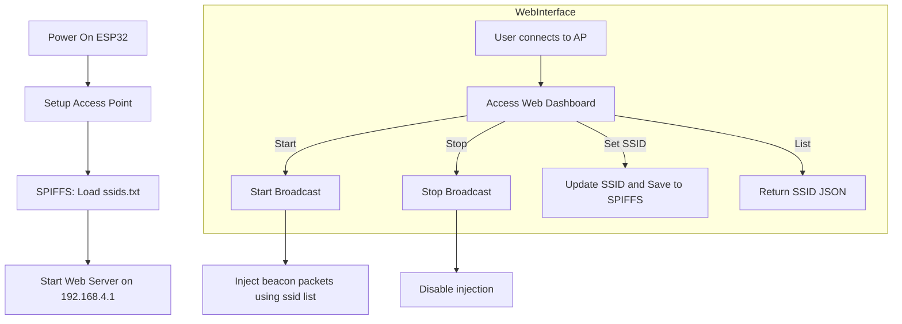

# ⚡ ESP32 Beacon Spammer Dashboard

<p align="center">
  
  
  
</p>

> A web-based fake SSID broadcaster using ESP32. This project allows you to **broadcast multiple Wi-Fi beacon frames** with custom SSIDs via a **hacker-themed dashboard** for educational and research purposes.

---

## 🧠 Overview

This tool enables the ESP32 to simulate Wi-Fi access points by **sending beacon frames** without actually establishing connections. It uses low-level `esp_wifi_80211_tx` APIs for raw packet injection, making it ideal for:

- Wi-Fi pentesting labs
- Cybersecurity education
- SSID flooding demonstrations
- Wireless traffic analysis practice

> ⚠️ It does **not** support client deauthentication or MITM attacks — it is strictly a **non-intrusive testing and educational tool**.

---

## ✨ Features

- 📡 Broadcasts up to **10 fake SSIDs** simultaneously.
- 🔧 Update SSID names on-the-fly from a web dashboard.
- 💾 Persistent SSID list stored in **SPIFFS filesystem**.
- 🌐 Local web server accessible via ESP32 AP (`192.168.4.1`).
- 🎨 Hacker-style UI with flashing **legal disclaimer**.
- 🧠 Built with native **ESP-IDF Wi-Fi functions**.

---

## 🛠️ Hardware Requirements

| Component     | Specification        |
|---------------|----------------------|
| **Board**      | ESP32-WROOM/ESP32 DevKit |
| **Power**      | 5V (USB)             |
| **Storage**    | SPIFFS (built-in flash) |
| **Others**     | Micro USB cable      |

---

## 📁 File Structure

```

/esp32-beacon-dashboard
├── main.ino                  // Main Arduino sketch
├── data/
│   └── ssids.txt             // Default/fetched SSIDs
├── README.md                 // This file

````

> Use `ESP32 Sketch Data Upload` plugin in Arduino IDE to upload `/data/` to SPIFFS.

---

## 🧪 Installation

### 1. Arduino Setup

- Install the [ESP32 board package](https://github.com/espressif/arduino-esp32).
- Add these libraries (if not already installed):
  - `WiFi.h`
  - `WebServer.h`
  - `SPIFFS.h`

### 2. Upload Code

- Upload the `main.ino` file to your ESP32 board.
- Use `Ctrl + Shift + U` to upload SPIFFS data (make sure `ssids.txt` is present).
- Open Serial Monitor @ `115200 baud`.

---

## 🌐 Web Interface (192.168.4.1)

The ESP32 creates an access point named **FBI Van #42** by default.

### Dashboard Features

| Section             | Purpose                            |
|---------------------|-------------------------------------|
| 🚀 Start Broadcast   | Begin sending beacon packets.       |
| 🛑 Stop Broadcast    | Cease all SSID broadcast.           |
| ✅ Set SSID          | Update SSID at any position 0–9.    |
| 📜 SSID List         | View current SSIDs from memory.     |
| 🖥 Console Output     | Live response from ESP32.           |

> Works on mobile too!

---

## 💾 SPIFFS Behavior

- On first boot, `ssids.txt` is created with **10 default SSIDs**.
- Any change through the web dashboard is automatically saved.
- SSIDs persist across reboots.

---

## 🔄 Beacon Broadcast Logic

Beacon frames are broadcast **continuously** when enabled. Each SSID is injected using:

```cpp
esp_wifi_80211_tx(WIFI_IF_AP, packet, packet_len, false);
````

The packet is constructed with:

* Type/Subtype: `0x80` (Beacon Frame)
* Random MAC for each frame
* Variable length based on SSID
* Frame sent every few milliseconds

---

## 📊 Technical Workflow Diagram (Mermaid)



---

## 🧩 Dashboard Screenshot

> 🖼 *You can add a screenshot here for visual reference.*

---

## 🔐 Legal Disclaimer

<div align="center">
  
</div>

> ⚠️ **This tool is intended for legal, ethical, and educational purposes only.**
> Unauthorized use in public networks or interference with real APs is **illegal** in many countries.
> Always test in **controlled environments** and with permission.

---

## 🚀 Contribution

Want to improve or fork it?

* Add emoji/randomized SSID generator.
* Include channel rotation for wider spoofing.
* Implement live console updates with WebSockets.
* Add dark/light toggle or branding options.

PRs welcome!

---

## 📜 License

This project is released under the [MIT License](LICENSE).

---

## 👤 Author

Developed by **K Rajtilak**

📎 [GitHub](https://github.com/rajtilak-2020)

🔗 Portfolio: [krajtilak.vercel.app](https://krajtilak.vercel.app)

---
